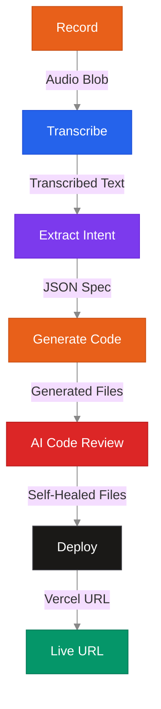
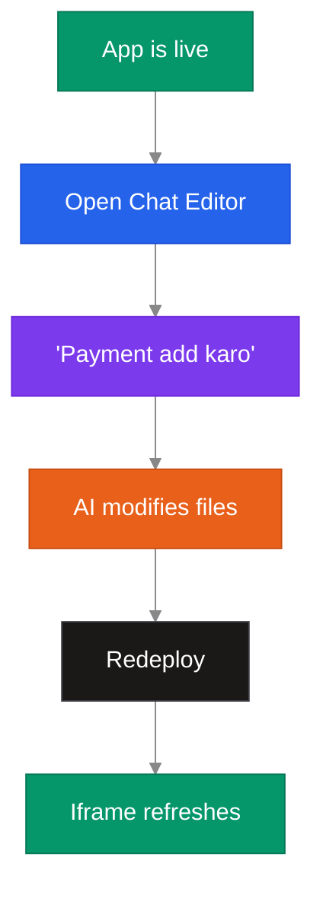
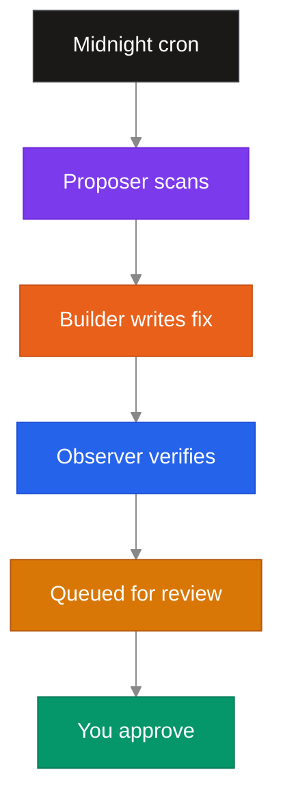
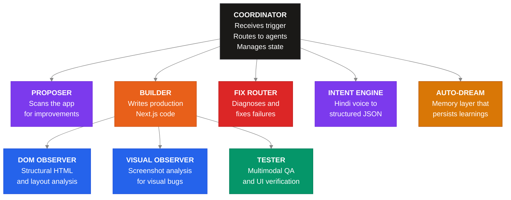
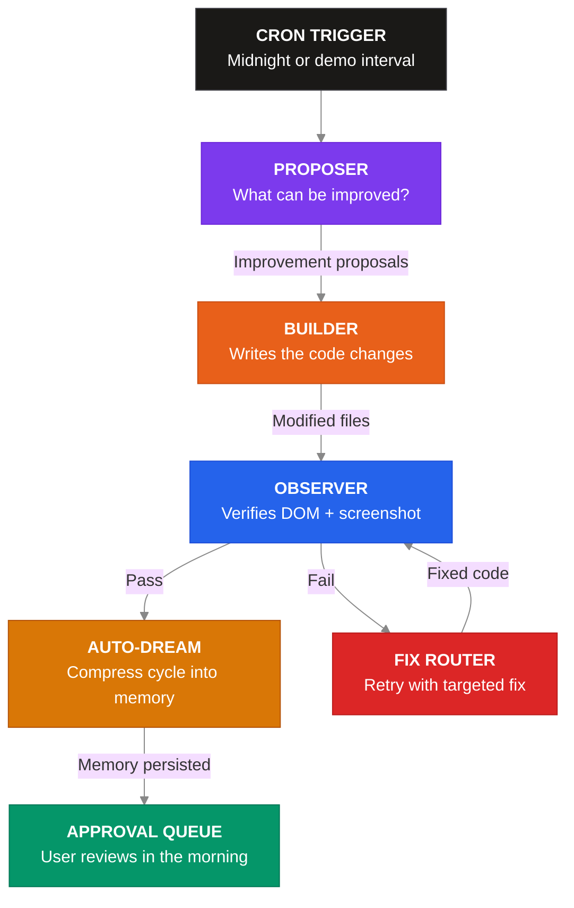
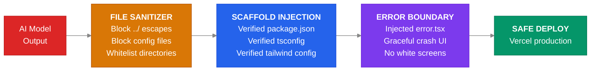
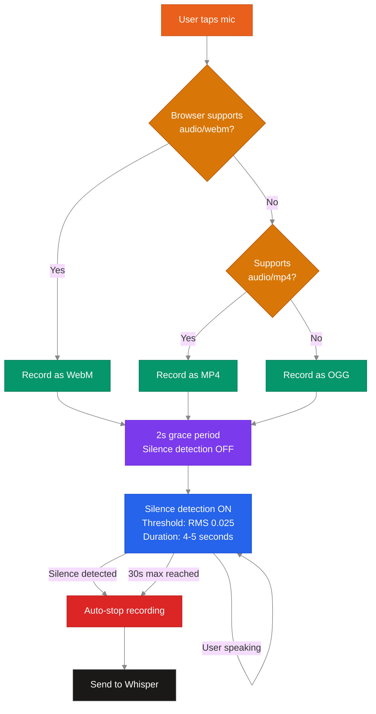

<br/>
<h1 align="center" style="font-family: 'Sora', sans-serif; font-size: 5em; font-weight: 800; color: #E8601A; letter-spacing: 0.1em; margin-bottom: 0;">MAYA</h1>
<h3 align="center">Voice-First Self-Evolving App Builder for Bharat</h3>

<p align="center">
  
  
  
  
  
</p>

<p align="center">
  <b>Available for Hindi and English users. Aspiring for diverse Indian languages in the future.</b>
</p>

---

<br/>

> A shopkeeper in Jaipur opens MAYA, taps one button, and says:
>
> *"Mujhe apni kirana dukaan ke liye ek app chahiye jismein stock manage ho, billing ho, aur customer ka hisaab rahe."*
>
> Three minutes later, a fully functional inventory and billing app is live on the internet with a shareable URL. That night, while the shopkeeper sleeps, MAYA studies the app, notices the billing page has no GST field, and quietly ships a fix. By morning, the app is better than it was yesterday.
>
> This is not a demo. This is the product.

<br/>

MAYA turns spoken intent into production software. No forms to fill. No templates to browse. No drag-and-drop. You speak, and a real application appears on the internet, purpose-built for your business. Then it keeps getting better on its own, every single night, without anyone asking it to.

India has over 60 million small businesses. The vast majority of them will never hire a developer or learn to code. MAYA exists so they do not have to. It gives every chai stall owner, every tailor, every neighbourhood pharmacy the same calibre of software that funded startups take months to build.

<br/>

---

## How It Works


<br/>

### The Three Core Features

<table>
<tr>
<td width="33%" valign="top">

<h4 align="center">Voice to Live App</h4>



Tap the mic. Speak in Hindi or English. Describe what your business needs. MAYA transcribes your voice, understands the intent, writes an entire Next.js application, and deploys it to Vercel. You get a live URL you can share with anyone, in under three minutes.

</td>
<td width="33%" valign="top">

<h4 align="center">Conversational Editor</h4>



A split-screen interface. Your chat history on the left, your live app preview on the right. Type or speak a change request in natural language. MAYA surgically edits only the files that need to change, redeploys, and the iframe refreshes with the update. No page reloads, no context switching.

</td>
<td width="33%" valign="top">

<h4 align="center">Self-Evolution</h4>



Every night, MAYA autonomously examines your application. A planning agent identifies what is missing or broken. A builder agent writes the fix. A visual observer confirms the UI still looks correct. The improvement is staged for your review. You approve or reject it in the morning. Your app gets better while you sleep.

</td>
</tr>
</table>

<br/>

---

## Agentic Architecture

MAYA operates on a multi-agent orchestration layer where specialized AI agents collaborate through a coordinator. Each agent has a single responsibility, a dedicated model optimized for that role, and strict boundaries that prevent it from overstepping.



<br/>

### Agent Roles Explained

| Agent | Responsibility | Optimized For |
|-------|---------------|---------------|
| **Coordinator** | Orchestrates the entire evolution cycle. Receives triggers from cron jobs or user actions, routes tasks to the appropriate agent, and manages the state machine. | Reliability, state management |
| **Proposer** | Examines an existing application and identifies concrete improvements. Produces a ranked list of changes with estimated impact scores. | Deep reasoning, planning |
| **Builder** | Takes a specification or change request and generates production-quality Next.js code. Outputs complete file payloads ready for deployment. | Speed, large code generation |
| **Fix Router** | Receives build errors or test failures and generates targeted patches. Understands error messages and produces minimal, surgical fixes. | Debugging, error analysis |
| **DOM Observer** | Analyzes the structural layout of the generated application by parsing its HTML/DOM tree. Flags accessibility issues, broken layouts, and missing elements. | Structural analysis |
| **Visual Observer** | Evaluates screenshots of the running application. Catches visual regressions, misaligned elements, and styling problems that DOM analysis alone would miss. | Multimodal vision |
| **Tester** | Performs comprehensive QA by combining visual and structural analysis. Verifies that the built application meets quality thresholds before staging improvements. | Quality assurance |
| **Intent Engine** | Converts raw Hindi (or English) voice transcriptions into structured JSON specifications. Maps spoken business requirements to categories, features, and data schemas. | Structured output, Hindi NLP |
| **Auto-Dream** | The memory consolidation layer. After each evolution cycle, it compresses observations and learnings into a persistent memory file that informs future cycles. | Long-term context retention |

<br/>

### Evolution Cycle



The evolution cycle is fully autonomous but human-gated. MAYA will never ship a change to your live app without your explicit approval. You stay in control while the system does the heavy lifting of identifying and building improvements.

<br/>

---

## Project Structure

```
app-maya/
  app/
    api/
      approve/        # Approve or reject staged improvements
      autodream/       # Memory consolidation endpoint
      build/           # Voice-to-app build pipeline
      chat-edit/       # Conversational app editing
      dashboard/       # Dashboard data with real build stats
      evolution/       # Trigger overnight evolution cycles
      evolution-log/   # Fetch evolution history per app
      skills/          # Runtime GitHub skill loader
      transcribe/      # Voice transcription via Whisper
      worktree/        # Git worktree management for builds
    app/
      [id]/            # Dynamic app detail page
        edit/          # Split-panel conversational editor
        evolution/     # Per-app evolution timeline
    approval/          # Staged improvement review UI
    builder/           # Build progress page with stage indicator
    dashboard/         # User's app gallery
    record/            # Voice recording page with auto-stop
    showcase/          # Public showcase of built apps
    sign-in/           # Clerk authentication
    sign-up/           # Clerk registration
  components/
    home-content.tsx   # Landing page hero and feature sections
    navigation.tsx     # Responsive nav with language toggle
    shader-background.tsx  # WebGL animated background
    ui-components.tsx  # Reusable UI primitives
  lib/
    agents/            # Agent implementations (proposer, builder, etc.)
    coordinator.ts     # Multi-agent orchestration engine
    deploy.ts          # Vercel deployment with scaffold injection
    memory/            # Auto-dream memory consolidation
    nim-client.ts      # AI model client with key rotation
    prompts/           # Category-specific prompt templates
    skills.ts          # GitHub skill and plugin loader
    store.ts           # App metadata persistence
    tools/             # Agent tool registry
    voice-pipeline.ts  # End-to-end voice-to-app pipeline
    worktree.ts        # Isolated build environments
  middleware.ts        # Auth-gated routing
```

<br/>

---

## Security and Safety

MAYA generates code at runtime and deploys it to the public internet. This demands multiple layers of safety.



| Layer | Protection |
|-------|-----------|
| **File Sanitizer** | Every file the AI produces is validated before being written to disk. Paths containing `..` are rejected. Absolute paths are rejected. Only files inside `app/`, `components/`, `lib/`, `hooks/`, `utils/`, and `public/` directories are allowed through. Config files like `package.json` and `.env` are explicitly blocked from AI modification. |
| **Scaffold Injection** | MAYA injects a verified `package.json`, `tsconfig.json`, `tailwind.config.ts`, and other build files before every deployment. These files are controlled by MAYA, not the AI model, ensuring the build environment is always stable. |
| **Error Boundary** | Every deployed app receives an automatically injected `error.tsx` component. If the generated React code crashes at runtime, the error is caught gracefully with a branded fallback UI instead of a broken white screen. |
| **Auth Gating** | The Clerk middleware blocks all authenticated routes. Without signing in, no page is accessible. Direct URL manipulation redirects back to the auth flow. |
| **Model Fallback** | If the primary AI writer hangs or times out (120 seconds), MAYA automatically retries with a secondary model. The system never gets stuck waiting for a single model to respond. |
| **API Key Rotation** | Both the transcription service and the AI model API use multi-key rotation. If one key hits a rate limit, the next key is used transparently without user-visible failure. |

<br/>

---

## Voice Recording Resilience

The microphone is the front door of MAYA. If it breaks, everything else is useless. The recording system handles every known edge case:




<br/>

---

## Tech Stack

| Layer | Technology |
|-------|-----------|
| Framework | Next.js 16 (App Router) |
| Language | TypeScript (strict) |
| Styling | Tailwind CSS 4 |
| Animation | Framer Motion, GSAP, WebGL Shaders |
| Auth | Clerk |
| Voice | Whisper Large V3 Turbo |
| Deployment | Vercel (programmatic REST API) |
| State | Local filesystem + Convex |

<br/>

---

## Supported Business Categories

MAYA ships with purpose-built prompt templates for each of these business types. When a user describes their shop, the intent engine automatically classifies it and loads the right template.

| Category | Example Businesses | Key Features Generated |
|----------|-------------------|----------------------|
| Kirana | Grocery stores, general stores | Stock management, barcode scanning, unit pricing, supplier tracking |
| Tailor | Tailoring shops, alteration services | Measurement profiles, fabric tracking, fitting schedules, order status |
| Dairy | Milk delivery, dairy products | Litre/kg quantities, morning/evening shifts, payment cycles |
| Pharmacy | Medicine shops | Batch numbers, expiry tracking, prescription management, MRP |
| Electronics | Mobile shops, repair centres | IMEI tracking, warranty management, repair status |
| Restaurant | Dhabas, restaurants, cafes | Menu management, table assignments, order status, veg/non-veg filters |
| Other | Any small business | Generic sales, stock, and customer tracking |

<br/>

---

## Runtime Skills and Plugins

MAYA pulls coding skills from GitHub repositories at runtime. These skills act as compressed expertise that augments the builder agent's output quality.

Currently loaded skills:

| Skill | Source | Purpose |
|-------|--------|---------|
| Caveman | GitHub (runtime pull) | Compressed prompt engineering for token-efficient code generation |
| Superpowers | GitHub (runtime pull) | Advanced UI patterns, animations, and interaction design |
| Frontend Design | GitHub (runtime pull) | Production-grade component architecture and design system enforcement |
| UI/UX Pro Max | GitHub (runtime pull) | Pixel-perfect responsive layouts and mobile-first patterns |

Skills are fetched on demand and cached locally. They are injected into the builder agent's system prompt to elevate the quality of generated applications without increasing the base model's training data.

<br/>

---

## Author

**Dherain Goud**

Built for Bharat.

<br/>

---

<p align="center">
  <i>Every small business in India deserves great software. MAYA makes sure they get it.</i>
</p>
