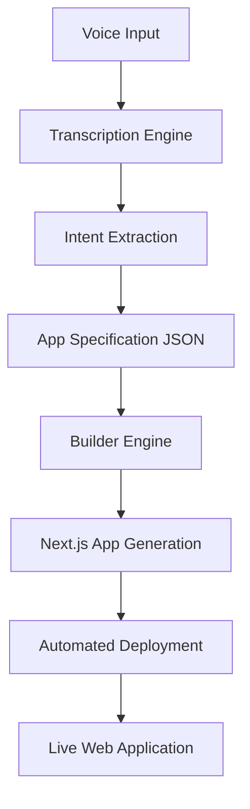
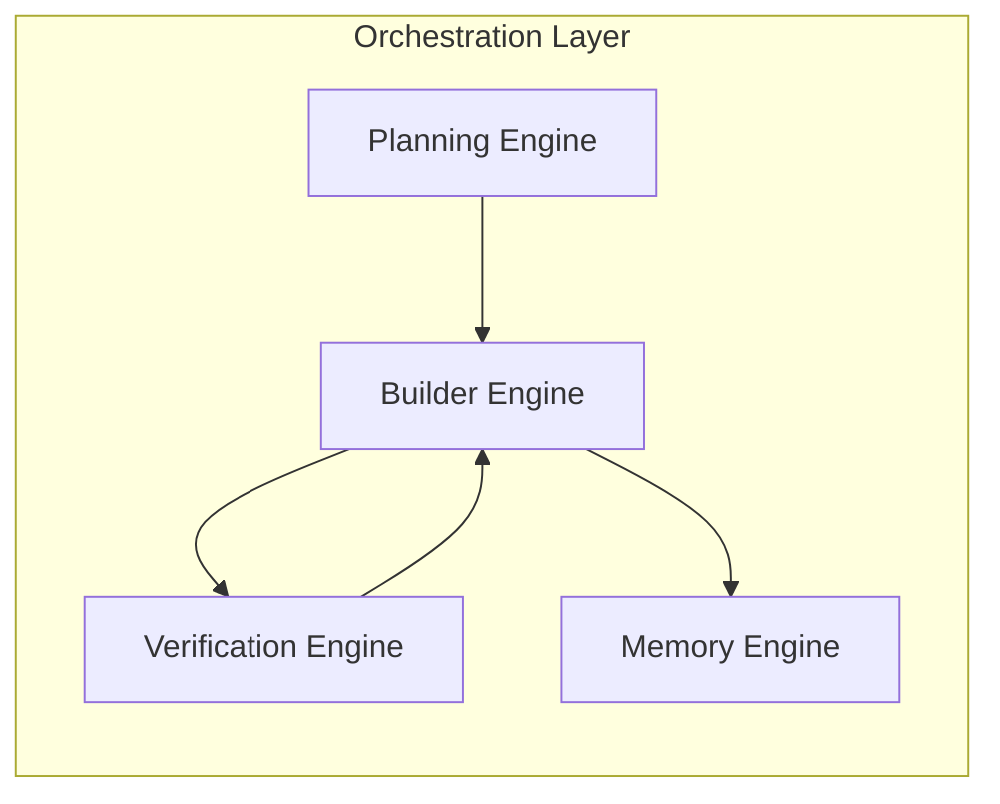

# MayaForBharat

MayaForBharat is an intelligent voice to app platform built for local businesses. It allows business owners to speak their requirements in their native language and instantly receive a fully functional, deployed web application. By eliminating technical barriers, MayaForBharat turns natural language directly into production ready software in minutes.

Author: Dherain Goud

## Core Workflow

The platform operates through a multi stage pipeline that processes voice input, extracts business intent, builds the application structure, and handles the deployment.

## Agentic Orchestration Layer

The system relies on a specialized orchestration layer where distinct cognitive engines handle specific phases of the application lifecycle.

### 1. Planning Engine
Analyzes the extracted user intent and creates a blueprint for the application. It decides the necessary data schemas, UI components, and routing logic required to fulfill the user request.

### 2. Builder Engine
Generates the application code based on the blueprint. It strictly follows a predefined design system, ensuring consistent layouts, typography, and interactive elements across all generated pages.

### 3. Verification Engine
Evaluates the generated application structure and visual layout. It identifies logical errors or UI inconsistencies and routes them back to the Builder Engine for targeted corrections.

### 4. Memory Engine
Consolidates the application state and changes over time. It maintains a historical log of user requests and code modifications, allowing the system to iterate on the application without losing previous context.

## Local Development

1. Install dependencies
\`\`\`bash
npm install
\`\`\`

2. Start the development server
\`\`\`bash
npm run dev
\`\`\`
